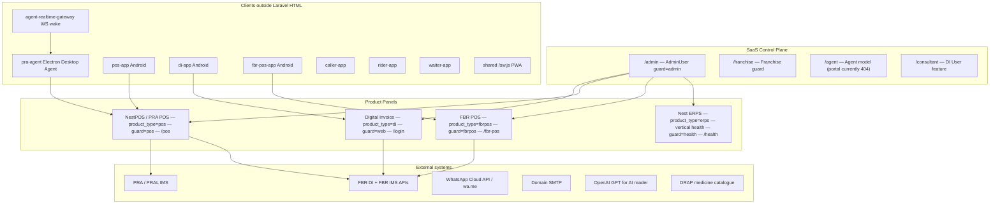

# 00 — System Overview

## What TaxNest actually is

**FACT:** TaxNest is a multi-tenant Laravel SaaS for Pakistan tax/invoice compliance and retail operations. It is **not** a single monolith product with one login — it is a **control plane** (`/admin`) plus **isolated product panels**, plus companion clients (Electron Desktop Agent, Android shells, PWA, realtime wake gateway).

**FACT — stack:** Laravel (composer.json / `replit.md`: Laravel 12 / PHP 8.4), Breeze-style session auth, Blade + Tailwind + Alpine.js, Vite, MariaDB/MySQL in production, database queues, Chart.js.

**FACT — production host narrative (`replit.md`):** Nayatel Islamabad VPS with MariaDB; app origin `taxnest.pk`.

## Ecosystem map (every participant)

## Repository topography (FACT)

| Path | Role |
|------|------|
| `app/` | Laravel domain (237 models, 111+ controller dirs, 173 services, 20 jobs) |
| `routes/web.php` | ~2900 lines — primary HTTP surface (panel + many APIs) |
| `routes/console.php` | Scheduler + artisan schedule |
| `config/auth.php` | 7 guards |
| `database/migrations/` | ~520 migrations |
| `resources/views/` | Blade UI (saas-admin, pos, fbr-pos, health, consultant, …) |
| `pra-agent/` | Electron Desktop Agent |
| `agent-realtime-gateway/` | Loopback WS wake publisher target |
| `pra-proxy/`, `pra-relay/` | PRA connectivity helpers |
| `pos-app/`, `di-app/`, `fbr-pos-app/`, `caller-app/`, `rider-app/`, `waiter-app/` | Mobile/companion clients |
| `docs/ops/` | Deploy / Live Ops / runbooks |
| `tests/` | PHPUnit Feature + Unit |
| `.github/workflows/` | PR checks, owner merge+deploy, production deploy, Live Ops, agent build |

## Scale signals (FACT, approximate)

- Models: ~237 under `app/Models`
- Controllers: large surface under `app/Http/Controllers` (+ `SaasAdmin/`, `Api/`, `Franchise/`, …)
- Services: ~173 under `app/Services`
- Migrations: ~520
- Feature tests: hundreds under `tests/Feature`
- Jobs: 20 classes under `app/Jobs`

## What this system is *not*

**FACT:** There is **no** Laravel Policies directory and **no** Gate definitions in app Providers — authorization is middleware + model helpers + controller aborts.

**FACT:** There is **no** `app/Events` / `app/Listeners` directory — domain events are mostly tables/rows + Observers + inline Auth event listeners.

**FACT:** README.md at repo root is stock Laravel — **not** the product map. Use `replit.md` + this folder.

## Reconstruction test answer

If rebuilding TaxNest from scratch tomorrow, you must rebuild:

1. Multi-guard session auth with shared `users` table scoped by `product_type`
2. Separate `admin_users` SaaS control plane
3. Four product lines (`di`, `pos`, `fbrpos`, `erps`) with isolated panels
4. Company tenancy via `company_id` + middleware binding `currentCompanyId`
5. Branch context via session + `BranchContextService`
6. Fiscal paths: DI→FBR DI API; NestPOS→PRA; FBR POS→FBR IMS
7. Desktop Agent command/print/PRA channel for NestPOS
8. Plans/subscriptions entitlement layer
9. Super Admin dual-mode impersonation

See subsequent documents for each layer.
