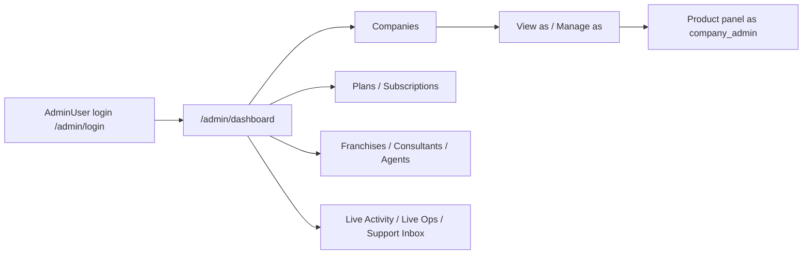

# 01 — SaaS Architecture

## Hierarchy (implemented)

```text
SAAS (AdminUser /admin)
  └── PRODUCT (companies.product_type: di|pos|fbrpos|erps)
        └── COMPANY (companies row — tenant root)
              └── OWNER / company_admin (users.role)
                    └── ADMIN / pos_admin (pos_role) / health roles
                          └── MANAGER (pos_manager; branch_user multi-branch)
                                └── TEAM (cashiers, waiters, riders, viewers, …)
                                      └── BRANCH (branches + branch_user + session active_branch_id)
                                            └── ROLE / PERMISSION (middleware + helpers — NOT Laravel Policies)
                                                  └── OPERATIONS (controllers/services)
```

**FACT:** This hierarchy is **not** one ORM tree. It is composed of:

| Level | Representation | Primary files |
|-------|----------------|---------------|
| SaaS | `admin_users` + guard `admin` | `AdminUser`, `AdminAuth`, `routes/web.php` `/admin/*` |
| Product | `companies.product_type` (+ `erps_vertical`) | `ProductCatalog`, `NestErps` |
| Company | `companies` | `Company` model |
| Owner/Admin/Team | `users` (+ `pos_role` / `health_role`) | `User` |
| Branch | `branches`, `branch_user`, session | `Branch`, `BranchContextService` |
| Franchise (lateral) | `franchises` + `companies.franchise_id` | `Franchise`, `/franchise/*` |
| Distributor Agent (lateral) | `agents` + `companies.agent_id` | `Agent` — portal currently 404 |
| CompanyGroup (admin insight) | `company_groups*` | `CompanyGroupService` — **not** login switcher |

## Control plane surfaces



**FACT — SaaS controllers:** under `app/Http/Controllers/SaasAdmin/` including `AdminAuthController`, `AdminDashboardController`, `AdminCompanyController`, `AdminGroupController`, `AdminPlanController`, `AdminSubscriptionController`, `AdminFranchiseController`, `AdminAgentController`, `AdminConsultantController`, `AdminLiveOpsController`, `AdminLiveActivityController`, `SupportInboxController`, etc.

**FACT — middleware:** `/admin/*` uses `admin.auth` (`App\Http\Middleware\AdminAuth`) which only checks `auth('admin')->check()` — **not** `super_admin`. Privileged actions call `assertSuperAdmin()` / `isSuperAdmin()` inside controllers.

## Tenant vs SaaS data access

| Actor | Cross-company? | How |
|-------|----------------|-----|
| Ordinary company user | No | Bound to `users.company_id` |
| SaaS AdminUser (any) | Can open `/admin/dashboard` aggregates | No `CompanyScope` on SaaS queries |
| SaaS `super_admin` | Yes — impersonation + Live Ops + agents | Explicit gates |
| Franchise | Only `franchise_id` companies | Franchise portal |
| Consultant | Consent-linked DI clients | Switch into client on `web` guard |

## Company groups (important non-login layer)

**FACT:** `CompanyGroupService` links sibling companies that are the “same customer” across product lines (CNIC/NTN evidence). Admin UI `/admin/groups`.

**FACT:** Groups do **not** grant a POS manager multi-company login. Staff remain 1× `users.company_id`.

## Lateral portals

| Portal | Guard / model | Notes |
|--------|---------------|-------|
| Franchise | `franchise` / `Franchise` | Live |
| Agent (distributor) | `agent` / `Agent` | Login/dashboard return **404** in current controllers |
| Consultant | DI `web` User + `ConsultantProfile` | Not a separate Authenticatable |
| Desktop Agent API | `agent.auth` middleware → `Company` by API key | Not the distributor portal |

## Invariants

1. SaaS admins and company users are **different tables**.
2. Product isolation is by **guard name** + `product_type`, not by separate user tables.
3. Cross-product “same business” insight is **admin-only** (company groups), never a tenant permission.
