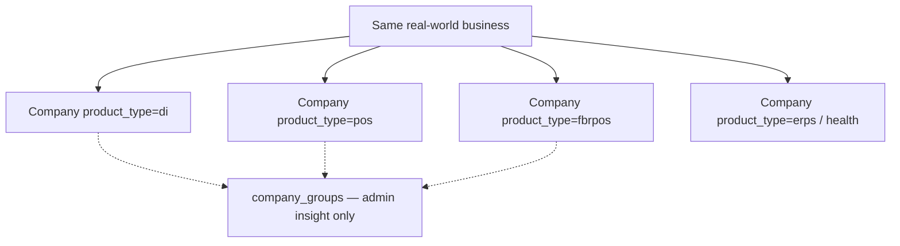

# 02 — Three Products (and the Fourth)

## Critical correction

The mission asked for “the exact **three** TaxNest products.”

**FACT from code:** The canonical catalog is **four** product types:

```php
// app/Support/ProductCatalog.php
public const TYPES = [self::DI, self::POS, self::FBRPOS, self::ERPS];
// di | pos | fbrpos | erps
```

**FACT:** `NestErps` docblock calls Nest ERPS “*the fourth product line*.” Healthcare is a **vertical inside** Nest ERPS (`companies.erps_vertical = health`), not a fifth `product_type`.

**FACT / LEGACY wording:** Comments in `IdentityScope` / `CompanyGroup` still say “three product lines” meaning DI + PRA POS + FBR POS — the original tax/regulator trio **before** Nest ERPS.

**INFERENCE:** Marketing or older ops language saying “three products” = DI / NestPOS / FBR POS. Engineering truth today = **four** in `ProductCatalog::TYPES`.

| Label used in speech | Canonical `product_type` | Panel |
|----------------------|--------------------------|-------|
| Digital Invoice / DI | `di` | Root `/login`, `/dashboard`, … (no `/di` UI prefix) |
| NestPOS / PRA POS | `pos` | `/pos/*`, guard `pos` |
| FBR POS | `fbrpos` | `/fbr-pos/*`, guard `fbrpos` |
| Nest ERPS | `erps` (legacy stored `health` still accepted) | Vertical `/health/*`, guard `health`; hub `/nest-erps` |

Legacy rewrite: `ProductCatalog::LEGACY` maps `'health' => 'erps'`.

---

## Product A — Digital Invoice (`di`)

| Dimension | FACT |
|-----------|------|
| Boundary | FBR Digital Invoicing (PRAL DI API) for B2B/B2C invoices |
| Guard | `web` → `User` |
| Login | `/login` |
| UI | Root app layouts (not under `/di`) |
| Controllers | `InvoiceController`, import/AI/ZIP/compliance controllers |
| API | `/api/di/v1/*` (`DiInvoiceApiController`) |
| Mobile | `di-app/` |
| Unique modules | Consultant console, AI Invoice Reader, white-label branding, HS intelligence, bulk import |
| Billing cadence | Monthly / Quarterly / Semi-Annual / Annual toggles (`replit.md`) |
| Fiscal | Sync `submitToFbrSync` (queued `SendInvoiceToFbrJob` exists but is orphaned — see contradictions) |

---

## Product B — NestPOS / PRA POS (`pos`)

| Dimension | FACT |
|-----------|------|
| Boundary | Retail POS with Punjab PRA fiscalization |
| Guard | `pos` |
| Login | `/pos/login` |
| UI | `resources/views/pos/*`, layout `pos-app` |
| Controllers | `PosController` (large), restaurant/rider/waiter controllers |
| Mobile | `pos-app/`, plus `caller-app`, `rider-app`, `waiter-app` |
| Desktop | `pra-agent/` Electron + optional print wake gateway |
| Unique modules | Restaurant, Madadgar, Desktop Agent, Local Bills, Live Ops (SaaS), hazri, deals |
| Rounding | Whole-rupee bill totals (`replit.md` + PosTaxMath paths) |
| Billing | Annual-only packages |
| Fiscal | `PraIntegrationService` + agent fiscal_device mode |

**Owner focus rule (`replit.md`):** current work focus NestPOS PRA unless owner says otherwise.

---

## Product C — FBR POS (`fbrpos`)

| Dimension | FACT |
|-----------|------|
| Boundary | FBR IMS POS fiscalization |
| Guard | `fbrpos` |
| Login | `/fbr-pos/login` |
| UI | `/fbr-pos/*`; universal sale screen only |
| Controllers | `FbrPosController`, catalogue/supplier controllers |
| Mobile | `fbr-pos-app/` |
| Unique modules | Pharmacy mode, Medicine Catalogue (DRAP), supplier ledger |
| Rounding | Keeps decimals (unlike NestPOS) |
| Fiscal | `FbrService` IMS endpoints + agent path |

---

## Product D — Nest ERPS (`erps`)

| Dimension | FACT |
|-----------|------|
| Boundary | Purpose-built ERP verticals under one product type |
| Authority | `App\Support\NestErps` registry |
| First vertical | Healthcare (`health`) |
| Guard | `health` (per vertical) |
| Paths | `/health/*`; public hub `/nest-erps` (enquiry-only) |
| Modules | OPD, pharmacy, IPD, accounts, HR, audit (toggled) |
| Roles | `users.health_role` + `health_permissions` via `HealthAccessService` |
| Mobile shell | **UNKNOWN / not found** as dedicated Android app in repo |

**Adding a vertical (FACT from NestErps docblock):** one registry entry + screens/routes/guard/lang — **no** new `product_type`, **no** new billing branch.

---

## Isolation rules between products

**FACT (`replit.md` + middleware):** DI and POS data fully isolated; no cross-login between product guards. Admin credentials may auto-detect on login forms. Identity uniqueness is **per product** (`IdentityScope`).

**FACT:** Same human may own multiple `companies` rows (one per product), optionally linked in `company_groups` for SaaS admin insight only.


