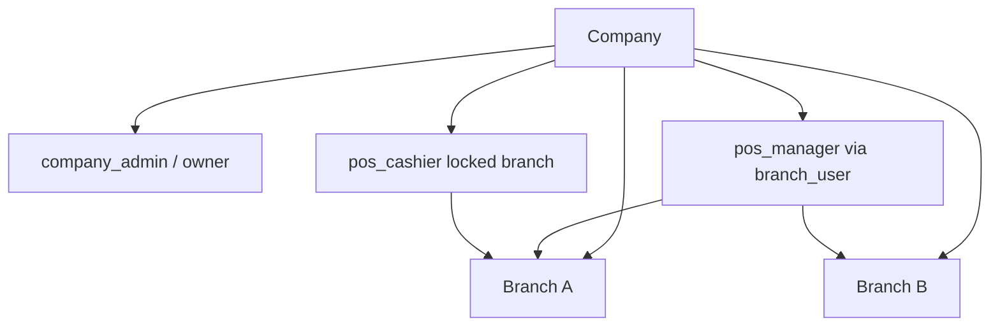

# 03 — Company Organization

## Company as tenant root

**FACT:** The tenant root is `companies.id`. Almost all operational tables carry `company_id`.

**FACT — authoritative company fields (selected):**
- Identity: `name`, `ntn`, `account_code`, `product_type`, `erps_vertical`
- Lifecycle: `status` (SaaS approval: pending/approved/…), `company_status` (active/pending/suspended)
- Fiscal: PRA/FBR tokens, environments, `pra_connection_mode`, reporting flags
- Agent: `agent_enabled`, `agent_api_key`, `agent_last_seen`, `agent_version`, `agent_force_update_at`
- Features: restaurant/pharmacy flags, dashboard style, printer JSON (`pos_printer_settings`)

**Classification:**
| Field group | Class |
|-------------|-------|
| Identity / product / status | AUTHORITATIVE |
| Agent last_seen / version telemetry | CACHE/STATE |
| Printer inventory in JSON | CACHE/STATE |
| Printer routing prefs in JSON | AUTHORITATIVE |
| Usage rollups | DERIVED |

## Owner → Admin → Manager → Team

**FACT — base `users.role`:** `company_admin`, `employee`, `viewer`, (rare) `super_admin` on User table.

**FACT — NestPOS `users.pos_role`:**
| Role | Meaning |
|------|---------|
| `pos_admin` | Full POS admin |
| `pos_manager` | Admin-equivalent inside POS (`User::isPosAdmin()` includes it) |
| `pos_cashier` | Confined cashier |
| `pos_kitchen` / `pos_waiter` / `pos_delivery` / `pos_rider` | Confined; often plan-limit exempt |
| `archive_viewer` / `local_viewer` | Read-only portals (SaaS-provisioned) |

**FACT helpers:** `app/Models/User.php` — `isPosAdmin()`, `isPosManager()`, `canRequeueExemptPra()` (managers **excluded**), `canManageLocalViewers()` (company_admin only), etc.

**FACT:** There is **no** multi-company staff pivot (`company_user`). One user → one `company_id`.

**Exception — branch_user:** managers may access **multiple branches inside one company** via `branch_user` (`BranchContextService`).

## Branches

**FACT:** `BranchContextService` (`app/Services/BranchContextService.php`):
- Session key `active_branch_id`
- Sentinel `ALL = 'all'` for owner company-wide view (`getActiveBranchId()` → null filter)
- Bound as `currentBranchId` by PosAuth / FbrPosAuth / HealthAuth / CompanyIsolation
- Switch: `POST /branch/switch`

**Role access (FACT from service docblock):**
- Owner / company_admin / super_admin → all branches
- Manager → branches in `branch_user` (multi-branch allowed)
- Cashier / employee → single branch (`default_branch_id`, locked)

## Approval / pending companies

**FACT:** `CompanyIsolation` force-logs-out non-`active` `company_status` on DI web. Middleware `company.approval` / `CheckCompanyApproval` blocks writes for pending companies while allowing view.

## Franchise / agent attachment

**FACT:** Optional `companies.franchise_id`, `companies.agent_id` — lateral revenue/partner relationships, not staff RBAC.

## Organizational diagram

