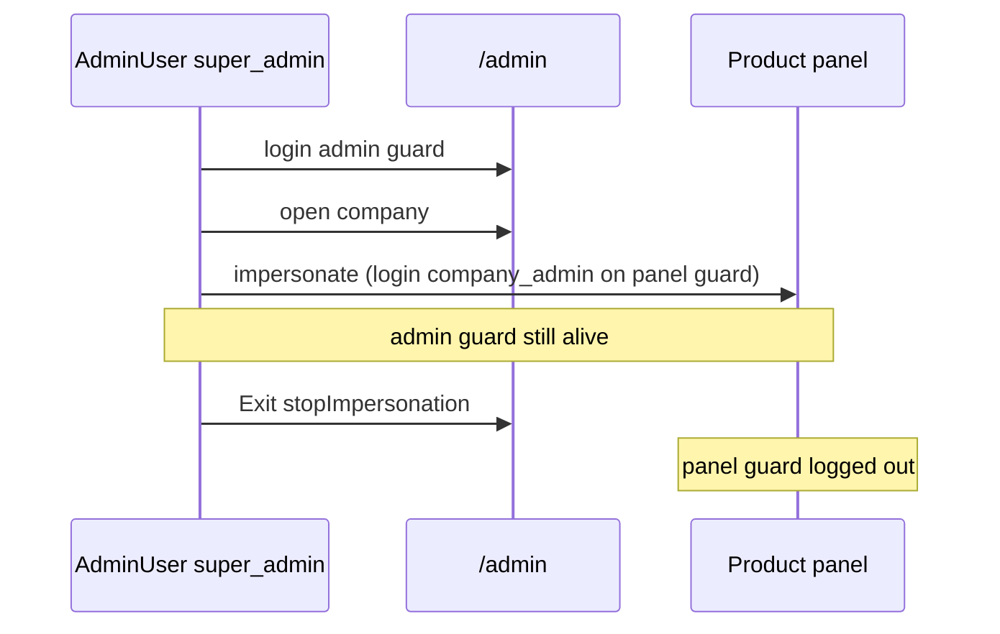

# 04 — Super Admin Architecture

## Two different “super_admin” concepts

| Kind | Model / table | Login | Purpose |
|------|---------------|-------|---------|
| **SaaS Super Admin** | `AdminUser` / `admin_users` where `role === 'super_admin'` | `/admin/login` guard `admin` | Control plane: companies, plans, Live Ops, impersonation |
| **Platform User super_admin** | `User.role === 'super_admin'` | DI `/login` | Rare; bypasses `RoleMiddleware` + `CompanyScope` |

**FACT:** Do not conflate them. Impersonation and Live Ops gates use **`AdminUser::isSuperAdmin()`**.

**FACT:** `AdminUser::isSuperAdmin()` → `app/Models/AdminUser.php`.

## Login → dashboard

```text
GET  /admin/login          AdminAuthController@showLogin
POST /admin/login          AdminAuthController@login  → Auth::guard('admin')->attempt
GET  /admin/dashboard      AdminDashboardController@index  (middleware admin.auth only)
```

**FACT:** `AdminAuth` middleware only verifies an AdminUser session exists — **not** super_admin. Dashboard aggregates are available to any authenticated AdminUser.

**FACT:** Privileged mutations (impersonation, Live Ops, archive viewers, force-delete, agent claims, …) call `assertSuperAdmin()` or `isSuperAdmin()` inside controllers.

## Cross-company powers (SaaS super_admin)

**FACT examples:**
- List/search any company (`AdminCompanyController@index` — search + status + product_type)
- Open company detail; start View as / Manage as
- Live Activity (`AdminLiveActivityController` — role check `=== 'super_admin'`)
- Live Ops (`AdminLiveOpsController::gate()` — `isSuperAdmin()`)
- Desktop Agent admin tools (`AdminAgentController`)
- Support Inbox (nav gated in layout to super_admin)

## What Super Admin cannot casually do

**FACT:** Without impersonation, Super Admin does **not** become a company user. SaaS queries are cross-tenant by design; company-panel operations require impersonation (or Live Ops runner/API on NestPOS).

**FACT:** Impersonation requires `company_status === 'active'` and an active `company_admin` (or POS `pos_admin` fallback).

## Session model during impersonation

**FACT:** Two guards coexist in one PHP session:
1. `admin` — AdminUser remains logged in
2. Panel guard (`web`|`pos`|`fbrpos`|`health`) — company’s admin User

**FACT:** Exit must logout **only** the panel guard (`stopImpersonation`). Never `session()->invalidate()` there — that would destroy admin too.

See `05-view-as-company.md` and `06-as-company.md`.

## Diagram


