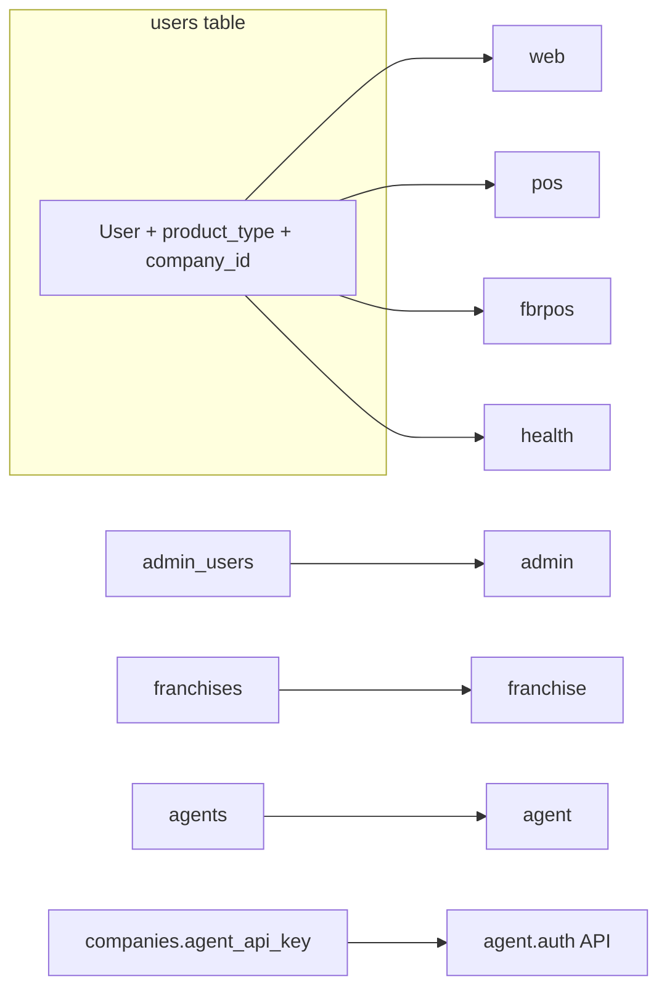

# 07 — Authentication

## Guards (FACT — `config/auth.php`)

| Guard | Provider | Model | Intended users |
|-------|----------|-------|----------------|
| `web` | `users` | `User` | Digital Invoice |
| `pos` | `users` | `User` | NestPOS |
| `fbrpos` | `users` | `User` | FBR POS |
| `health` | `users` | `User` | Nest ERPS Healthcare |
| `admin` | `admin_users` | `AdminUser` | SaaS admins |
| `franchise` | `franchises` | `Franchise` | Franchise portal |
| `agent` | `agents` | `Agent` | Distributor portal (currently 404) |

**FACT:** Company panels share one `users` table; uniqueness is composite with `product_type` (`IdentityScope`).

**FACT:** Password reset broker exists for `users` only — not admin/franchise/agent.

## Login surfaces

| Product | Login path | Middleware after login |
|---------|------------|------------------------|
| DI | `/login` | `auth` + `company` (+ approval/rate limits) |
| NestPOS | `/pos/login` | `pos.auth` |
| FBR POS | `/fbr-pos/login` | `fbrpos.auth` |
| Health | `/health/login` | `health.auth` |
| SaaS | `/admin/login` | `admin.auth` |
| Franchise | `/franchise/login` | `franchise.auth` |

**FACT (`replit.md`):** Identifiers = Email / Phone / Username / CNIC / NTN; admin creds may auto-detect across forms; pending companies view-only.

## Desktop Agent authentication (distinct)

**FACT:** Middleware `agent.auth` (`AgentAuth`) — Bearer / `X-Agent-Key`. Lookup
is by `companies.agent_api_key_hash` (sha256) then `hash_equals`; legacy
plaintext `agent_api_key` still authenticates once and is healed. The plaintext
column remains so in-field agents and the owner panel copy-key UI keep working.
`/api/agent/*` is throttled (`throttle:agent-api`, 600/min per presented key)
and failed auths are limited per IP. `agent_api_key` is `$hidden` on Company.

## Demo login (local only)

**FACT:** `GET /demo-login/{role}` is registered for `company_admin|demo` only.
`AuthenticatedSessionController::demoLogin` returns 404 unless `APP_ENV=local`
AND `config('app.demo_login_enabled')` (env `DEMO_LOGIN_ENABLED`). A seeded
account whose `users.role` is `super_admin` (or that has no `company_id`) is
refused even when the switch is on. Production HTTP cannot use this path.

## Distributor portal

**FACT:** `/agent/login` and `/agent/*` remain 404 by design
(`AgentPortalAuthController`). Distributors are referral-only records.
The `agent` guard exists for historical credentials and must not establish
a session.

## Consultant authentication pattern

**FACT:** Not a guard. `ConsultantProfile` on a DI `User`. Session `consultant_console`. Switch logs in as client `company_admin` on `web`. Exit `/consultant/exit`. Guarded continuously by `ConsultantSwitchGuard`.

## Session coexistence

| Scenario | Guards alive |
|----------|--------------|
| Normal company user | One panel guard |
| SaaS admin only | `admin` |
| Impersonation | `admin` + panel guard |
| Consultant switch | `web` as client (+ consultant session meta) |

## Logout rules under impersonation

**FACT:** Panel logout is blocked; must use Exit (`ReadOnlyImpersonation`). Admin logout via `/admin/logout` invalidates whole session (**INFERENCE:** would also clear impersonation as side effect of invalidate).

## Diagram

