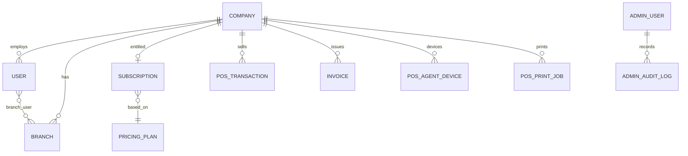

# 10 — Database Domain Model

## How to read this document

Do not treat the ~520 migrations as a flat table list. Domain clusters below matter. Every important field group is classified:

- **AUTHORITATIVE** — source of truth
- **DERIVED** — computed from authoritative data
- **CACHE/STATE** — ephemeral operational state
- **SNAPSHOT** — frozen at a moment (must not silently rewrite)
- **AUDIT** — immutable/append-only trail

## Core SaaS

| Entity | Table | Notes |
|--------|-------|-------|
| Company | `companies` | Tenant root; product_type AUTHORITATIVE |
| User | `users` | Staff; company_id AUTHORITATIVE |
| AdminUser | `admin_users` | SaaS |
| Plan | `pricing_plans` | Catalog AUTHORITATIVE |
| Subscription | `subscriptions` | Entitlement AUTHORITATIVE; quote SNAPSHOT |
| PaymentProof | `payment_proofs` | Evidence AUTHORITATIVE |
| Franchise / Agent | `franchises`, `agents` | Partner entities |
| CompanyGroup | `company_groups*` | Admin insight |
| Branch | `branches`, `branch_user` | Intra-company |
| SystemSetting | `system_settings` | Global KV |

## Digital Invoice

| Entity | Class notes |
|--------|-------------|
| `invoices` / `invoice_items` | AUTHORITATIVE business docs; FBR numbers AUTHORITATIVE once assigned |
| `invoice_deliveries` | AUDIT/STATE of buyer send |
| `fbr_logs` | AUDIT of DI API traffic |
| `customer_profiles`, `products` | AUTHORITATIVE master data (scoped) |
| Import batches / AI parses | STATE + results |

## NestPOS

| Entity | Class notes |
|--------|-------------|
| `pos_transactions` / items / payments | AUTHORITATIVE sale; `pra_*` mix AUTHORITATIVE result + CACHE queue state |
| `pos_print_jobs` | STATE machine; `target_printer` SNAPSHOT |
| `pos_agent_devices` | Identity AUTHORITATIVE; last_seen CACHE |
| `pra_logs` | AUDIT |
| Restaurant / riders / deals / hazri tables | Domain modules |
| Local/final serial counters | AUTHORITATIVE numbering |

## FBR POS

Mirror of POS patterns with `fbr_pos_*`, `fbr_pos_logs`, pharmacy/catalogue/supplier tables. Supplier balance DERIVED via `SupplierLedgerService` (**FACT:** only balance authority).

## Nest ERPS Healthcare

`health_*` patients, visits, admissions, bills, journals, audit events. Charges never deleted — reversals (**FACT** from replit.md / health docs).

## Live Ops

`live_ops_audit_events`, `live_ops_diagnostic_reports`, `live_ops_remediation_requests`, `live_ops_agent_commands` — AUDIT + STATE for NestPOS ops.

## Relationships (simplified)

## Deletion behavior (high level)

**FACT / INFERENCE mix:** Soft deletes on companies; health charges reverse not delete; supplier payments void-only; fiscal numbers once assigned must not be casually rewritten. Always check the specific model before cascading.

## Authoritative vs derived cheat sheet

| Concept | Class |
|---------|-------|
| company_id on operational rows | AUTHORITATIVE ownership |
| Subscription active + dates + overrides | AUTHORITATIVE access |
| Plan limits | AUTHORITATIVE catalog |
| billableCount at runtime | DERIVED |
| agent_last_seen | CACHE/STATE |
| Print job status/claim_token | CACHE/STATE |
| target_printer on job | SNAPSHOT |
| Tax rate on line at sale | SNAPSHOT |
| AdminAuditLog / PraLog / FbrLog | AUDIT |
