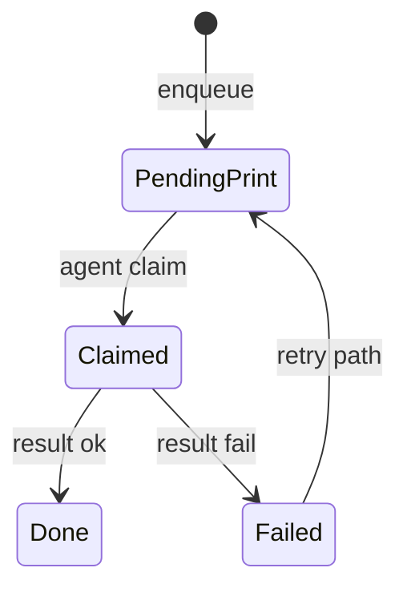

# 12 — State Machines

## Company lifecycle

| Field | States (observed) | Notes |
|-------|-------------------|-------|
| `status` | pending / approved / suspended / … | SaaS listing filter |
| `company_status` | active / pending / suspended | Panel access gate |

Pending → view-only / logout depending on middleware.

## DI invoice lifecycle

**FACT (`replit.md`):** Simplified 4-state lifecycle for DI invoices (draft → … → FBR success/fail). Exact enum values live on `invoices` columns — read model/migrations before changing.

FBR invoice number once assigned = AUTHORITATIVE fiscal identity.

## POS transaction PRA state

Common `pra_status` values used in code paths: `pending`, `submitted`, offline/queued variants, `failed`, NULL for reporting-OFF finals.

**Invariant (`replit.md`):** Reporting OFF finals = regulator mode + NULL status — **never** `'local'`.

## Print job FSM

`pos_print_jobs.status`: pending → claimed/printing → done | failed (attempts counter). Claim token prevents double claim.

## Live Ops remediation

`live_ops_remediation_requests.status`: proposed → approved → executed | rejected (and expiry). Requires owner phrase for approve.

## Live Ops agent commands

`pending → acked → succeeded|failed|expired` (`LiveOpsAgentCommandService`).

## Subscription / override

Active flag + end dates; overrides `lifetime|usage_free|temporary|grace` — grace/usage_free **retired in UI** but legacy rows honored (`replit.md`).

## Health admission / billing

Admission request → deposit → bed → care → discharge clearance. Charges reverse, never delete.

