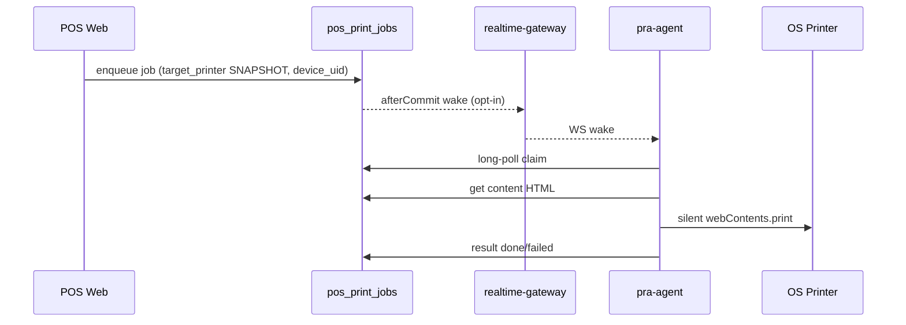

# 16 — Printing & Devices

## End-to-end

## Per-counter devices

**FACT:** `pos_agent_devices` unique (`company_id`, `device_uid`). Shared API key; counters distinguished by `device_uid`.

**FACT:** `users.pos_device_uid` assigns cashier → counter.

Online window: last_seen within ~2 minutes (`Company::agentOnline()` / device helpers).

## Company printer settings

JSON `companies.pos_printer_settings` via `Company::printerSettings()`:
- Routing keys AUTHORITATIVE (`receipt_printer`, `kot_printer`, silent_print_enabled, device bindings)
- `available_printers` CACHE from last reporter

## Claim rules

Agent with device_uid: own jobs + NULL legacy jobs.  
Agent without device_uid: NULL-only (legacy).

## Duplicate-print guard (Sep 2026)

`pos_print_jobs.content_fetched_at` is stamped the first time GET
`/api/agent/print-jobs/{id}/content` is served for a job in `printing`.

Housekeeping (`AgentController::printJobsHousekeeping`):

- stale `printing` AND content never fetched → requeue to `pending` (nothing
  could have printed; attempts < 3).
- stale `printing` AND content was fetched → `failed`
  (`unconfirmed_after_print_content_fetched`). Paper may have printed; the
  shop reprints deliberately. Automatic requeue here would duplicate paper.
- unstamped `pending` older than `config('print.pending_expiry_hours')`
  (default 24) → `failed` (`expired_unclaimed`). Rows are never deleted for
  this reason; the 7-day purge still only touches `done`/`failed`.

There is no `claimed_at` / `printed_at` column. Claim is the
`pending → printing` update plus `claim_token`; confirmation is `status=done`.

## Test print

Server remediation / UI can enqueue test print jobs; agent `TEST_PRINT` Live Ops command refreshes printers and nudges claim loop (does not invent local print outside queue).

## KOT

Restaurant KOT jobs carry `printed_item_ids` SNAPSHOT; routing via Kot services + counter flags.

**FACT (Sep 2026):** Offline Local Core owns a kitchen slip only while it can
print it. After the cloud accepts `order.held`, an empty silent-print plan or
an immediate local print failure hands the slip back (`print.fail{terminal}`)
so the cloud agent prints without a 3–5 minute wait. Unsynced holds (internet
down) stay queued locally.

**FACT:** A dead/unresponsive shop PC (three missed ~30s heartbeats = 90s, or
an immediate Local Core-down report from the sale/waiter screen) must not sit
in silent `Printing (local)` for the 5-minute handoff timeout. Instant
automatic reprint is used only when it is proven safe (cloud claim whose
content was never fetched). After content fetch, or for a local handoff the
shop PC may already have printed, the job becomes Action Required immediately
so staff check the tray and reprint deliberately.

**FACT:** `print:expire-local-handoffs` is an independent overdue-handoff
watchdog. It first parks dead-agent handoffs as Action Required, then expires
still-online hung drains past `LOCAL_HANDOFF_TIMEOUT_SECONDS`. Agent claim
housekeeping still sweeps, but recovery must not depend on an agent poll.

**FACT:** Unstamped claim eligibility matches `target_printer` to reported
queue names after case/space fold (`PrinterIdentity`). The stored snapshot is
not rewritten. Content-fetched unknown outcomes still fail closed (no blind
reprint).
