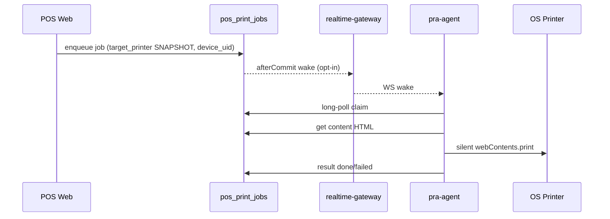

# 16 — Printing & Devices

## End-to-end

## Per-counter devices

**FACT:** `pos_agent_devices` unique (`company_id`, `device_uid`). Shared API key; counters distinguished by `device_uid`.

**FACT:** `users.pos_device_uid` assigns cashier → counter.

Online window: last_seen within ~2 minutes (`Company::agentOnline()` / device helpers).

## Company printer settings

JSON `companies.pos_printer_settings` via `Company::printerSettings()`:
- Routing keys AUTHORITATIVE (`receipt_printer`, `kot_printer`, silent_print_enabled, device bindings)
- `available_printers` CACHE from last reporter

## Claim rules

Agent with device_uid: own jobs + NULL legacy jobs.  
Agent without device_uid: NULL-only (legacy).

## Test print

Server remediation / UI can enqueue test print jobs; agent `TEST_PRINT` Live Ops command refreshes printers and nudges claim loop (does not invent local print outside queue).

## KOT

Restaurant KOT jobs carry `printed_item_ids` SNAPSHOT; routing via Kot services + counter flags.
