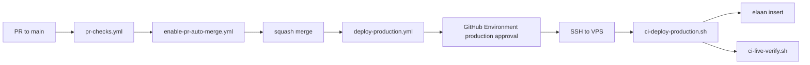

# 21 — Deployment

## Intended production path (FACT)

Artifacts: `.github/workflows/deploy-production.yml`, `scripts/ci-deploy-production.sh`, `deploy/elaan.yml`, `docs/ops/github-production-deploy.md`.

## PWA cache bust on the Actions path

`scripts/lib/live-remote-apply.sh` stamps the **served** `public/sw.js`
`CACHE_VERSION` on live as `taxnest-<UTC date>-<sha8>` after the exact-SHA
checkout (working tree only, restored before the next checkout). A new SHA
always changes the version so devices purge STATIC/RUNTIME caches. Same-SHA
re-runs are deterministic. This replaces the `deploy-live.sh` CACHE_VERSION
**commit**, which Actions cannot do.

## Manual path still exists

`scripts/deploy-live.sh` + `deployment/*` — older/manual.

## Contradiction

`docs/ops/healthcare-pilot-runbook.md` claims GitHub push deploys nothing / only `deploy-live.sh`.  
**FACT:** Actions production deploy is the current intended path after merge to `main`. Document both; prefer Actions docs for new work.

## Live Ops workflows

`live-ops-diagnose.yml`, `live-ops-remediate.yml` — Environment approval; Cloud Agent is planner only.

## Agent build

`build-agent.yml` — Desktop Agent packaging.

## Cloud Agent rules

No production SSH/secrets in Cloud Agent env. See `AGENTS.md`, `docs/ops/cloud-agent-*.md`.
