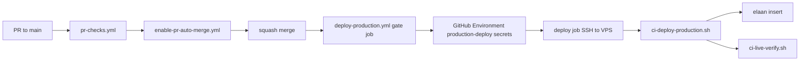

# 21 — Deployment

## Intended production path (FACT)

**FACT:** `gate` requires the requested SHA to equal the current `origin/main` **tip** (not merely an ancestor) before any Environment secrets. `skip_elaan` and `allow_settings` are refused on this workflow. Stale waiting runs are cancelled; in-flight SSH is never cancelled (`deploy` concurrency `production-deploy` + `cancel-in-progress: false`). Environment `production-deploy` holds deploy secrets and must **not** have required reviewers. Live Ops stays on Environment `production` **with** required reviewers (GitHub protection is per-Environment). Elaan remains fail-closed. CI publishes `{deploy/elaan.yml title} [deploy {TARGET_SHA}]` so a new SHA cannot no-op against an older AppUpdate with the same human title.

Artifacts: `.github/workflows/deploy-production.yml`, `scripts/ci-deploy-production.sh`, `scripts/lib/deploy-main-tip-guard.sh`, `scripts/lib/elaan-deploy-title.py`, `scripts/lib/live-dirty-worktree.sh`, `scripts/lib/live-dirty-worktree-classify.py`, `deploy/elaan.yml`, `docs/ops/github-production-deploy.md`.
Reports: `docs/architecture/34-production-deployment-concurrency-elaan-forensic-audit.txt`, `docs/architecture/35-production-deployment-stale-sha-fix-report.txt`, `docs/architecture/36-elaan-freshness-idempotency-fix-report.txt`, `docs/architecture/37-production-sw-dirty-worktree-fix-report.txt`, `docs/architecture/41-production-unattended-deploy-audit.txt`.

## PWA cache bust on the Actions path

`scripts/lib/live-remote-apply.sh` stamps the **served** `public/sw.js`
`CACHE_VERSION` on live as `taxnest-<UTC date>-<sha8>` after the exact-SHA
checkout (working tree only, restored before the next checkout). A new SHA
always changes the version so devices purge STATIC/RUNTIME caches. Same-SHA
re-runs are deterministic. This replaces the `deploy-live.sh` CACHE_VERSION
**commit**, which Actions cannot do.

**FACT (Deploy Production #16):** that leftover working-tree stamp is
intentional and is **not** committed. The CI/manual dirty-tree preflight
(`scripts/lib/live-dirty-worktree.sh`) runs **before** `remote_apply`. It
allows `public/sw.js` only when `git diff HEAD -- public/sw.js` is solely
that stamp line. Any other tracked dirty file, or any extra `sw.js` hunk,
still fail-closes. The preflight does not stash, reset, checkout, or
clean. `remote_apply` still restores the file immediately before the next
exact-SHA checkout, then restamps.

## Manual path still exists

`scripts/deploy-live.sh` + `deployment/*` — older/manual.

## Contradiction

`docs/ops/healthcare-pilot-runbook.md` claims GitHub push deploys nothing / only `deploy-live.sh`.  
**FACT:** Actions production deploy is the current intended path after merge to `main`. Document both; prefer Actions docs for new work.

## Live Ops workflows

`live-ops-diagnose.yml`, `live-ops-remediate.yml` — Environment `production` **required reviewers**; Cloud Agent is planner only. Deploy Production uses a **different** Environment (`production-deploy`) so removing deploy reviewers cannot auto-start Live Ops.

## Agent build

`build-agent.yml` — Desktop Agent packaging.

## Cloud Agent rules

No production SSH/secrets in Cloud Agent env. See `AGENTS.md`, `docs/ops/cloud-agent-*.md`.
